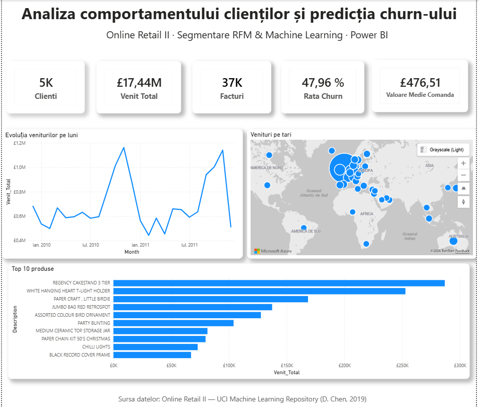
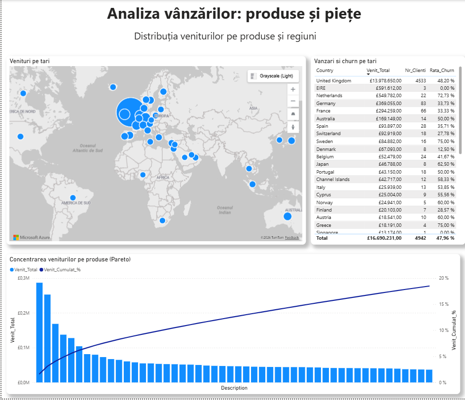

# Customer Churn & Retail Analytics — Online Retail II

Dashboard Power BI de analiză a comportamentului clienților și predicție a riscului de churn (plecare), construit pe date **reale** de tranzacții de la un retailer online din Marea Britanie.

## Ce face proiectul

- Curăță și procesează ~1.067.000 de tranzacții reale, păstrând 802.654 (75%) după eliminarea rândurilor fără client, anulărilor și a codurilor non-produs
- Construiește profilul **RFM** (Recency, Frequency, Monetary) pentru 4.942 de clienți identificabili
- Segmentează clienții cu **K-Means clustering** (VIP, High-Value, Mid-Value, Occasional) și cu reguli RFM (Champions, Loyal Customers, At Risk, Hibernating etc.)
- Prezice riscul de churn cu un model **Random Forest**, evaluat corect prin split temporal (fără data leakage) și cross-validation out-of-fold
- Simulează impactul unei campanii de retenție asupra veniturilor la risc

**Performanța modelului de churn:** Accuracy 72.3% · Precision 68.9% · Recall 77.2% · F1 72.8%

## Sursa datelor

Dataset **Online Retail II**, donat de Dr. Daqing Chen (London South Bank University) prin [UCI Machine Learning Repository](https://archive.ics.uci.edu/dataset/502/online+retail+ii), licențiat **CC BY 4.0**. Conține tranzacții reale (decembrie 2009 – decembrie 2011) ale unui retailer online de cadouri și decorațiuni.

## Tehnologii

- **Power BI Desktop** + DAX
- **Python** (pandas, scikit-learn) — curățare date, RFM, K-Means, Random Forest
- **Power Query (M)** pentru ETL

## Fișiere

- `comporatmentClienti.pbix` — dashboard-ul complet, gata de deschis în Power BI Desktop
- `pipeline_clienti.py` — pipeline-ul Python complet (curățare → RFM → clustering → model churn → export)
- `clienti.csv` — profilul RFM + scorul de churn per client, folosit de dashboard
- `churn_metrics.csv`, `feature_importance.csv` — metricile modelului și importanța variabilelor

## Paginile raportului

### 1. Prezentare

Pagina de start: KPI generali (5K clienți, 17,44M £ venit total, 37K facturi, 47,96% rată churn, valoare medie comandă), evoluția lunară a veniturilor, distribuția geografică a veniturilor (hartă) și top 10 produse după venit.

### 2. Produse & Geografie

Analiză detaliată pe țări (hartă + tabel cu venit, număr clienți, rată churn per țară) și un grafic Pareto al produselor după venitul cumulat.
